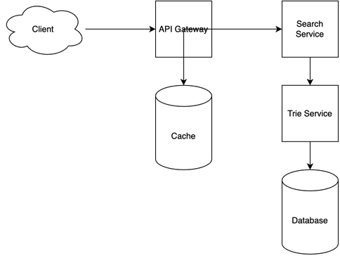

# Autocomplete Search System Design

[← Back to System Design](../system-design.md)

## Overview

An autocomplete search system is a real-time suggestion engine that helps users find content quickly by providing instant search suggestions as they type. The system needs to handle high query volumes, maintain low latency for real-time suggestions, and provide relevant results based on user input, search history, and popular trends. It's a critical component in modern web applications, requiring efficient data structures and caching mechanisms to deliver fast and accurate suggestions.

## Functional Requirements

## Non-Functional Requirements

## Back of the Envelope Estimations

## API Endpoints

## Object Model

## System Design Diagram

[Download Draw.io File](autocomplete-search.drawio)

## Additional Notes
