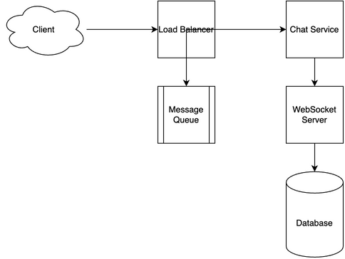

# Chat System Design

[← Back to System Design](../system-design.md)

## Overview

A chat system enables real-time communication between users through text messages, supporting features like one-on-one chats, group chats, and message delivery status. The system needs to handle millions of concurrent connections, ensure message delivery in real-time, maintain message history, and provide features like typing indicators, read receipts, and media sharing. It requires robust WebSocket connections, efficient message queuing, and scalable storage solutions to maintain performance and reliability.

## Functional Requirements

## Non-Functional Requirements

## Back of the Envelope Estimations

## API Endpoints

## Object Model

## System Design Diagram

[Download Draw.io File](chat-system.drawio)

## Additional Notes
