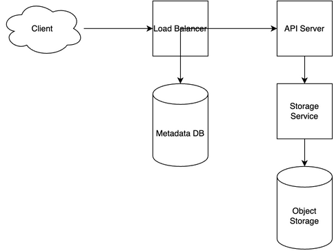

# Dropbox System Design

[← Back to System Design](../system-design.md)

## Overview

Dropbox is a cloud storage and file synchronization service that allows users to store, share, and access files across multiple devices. The system needs to handle massive file storage, real-time synchronization, version control, and secure file sharing. It requires efficient data deduplication, robust conflict resolution, and scalable storage infrastructure to maintain performance and reliability across global regions.

## Functional Requirements

## Non-Functional Requirements

## Back of the Envelope Estimations

## API Endpoints

## Object Model

## System Design Diagram

[Download Draw.io File](dropbox.drawio)

## Additional Notes
