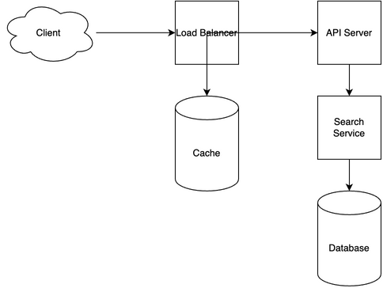

# Email Archive System Design

[← Back to System Design](../system-design.md)

## Overview

An email archive system is designed to store, index, and retrieve historical email communications for compliance, legal, and business purposes. The system needs to handle massive email storage, efficient search capabilities, data retention policies, and secure access controls. It requires robust indexing mechanisms, data compression, and compliance features to maintain regulatory requirements while ensuring quick access to archived emails.

## Functional Requirements

## Non-Functional Requirements

## Back of the Envelope Estimations

## API Endpoints

## Object Model

## System Design Diagram

[Download Draw.io File](email-archive.drawio)

## Additional Notes

## Components
