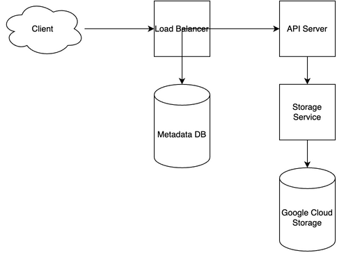

# Google Drive System Design

[← Back to System Design](../system-design.md)

## Overview

Google Drive is a cloud-based file storage and synchronization service that enables users to store, share, and collaborate on files. The system needs to handle massive file storage, real-time collaboration, version control, and seamless integration with other Google services. It requires efficient data deduplication, conflict resolution, and a scalable infrastructure to support millions of concurrent users and their collaborative workflows.

## Functional Requirements

## Non-Functional Requirements

## Back of the Envelope Estimations

## API Endpoints

## Object Model

## System Design Diagram

[Download Draw.io File](google-drive.drawio)

## Additional Notes

