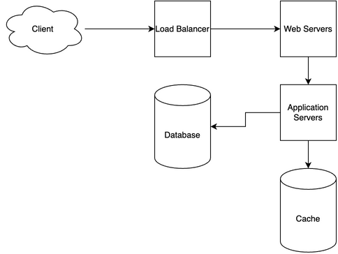

# Instagram System Design

[← Back to System Design](../system-design.md)

## Overview

Instagram is a social media platform focused on photo and video sharing, with features like stories, reels, and direct messaging. The system needs to handle massive media storage, real-time content delivery, social interactions, and personalized content recommendations. It requires efficient content delivery networks, robust caching mechanisms, and a scalable infrastructure to support billions of users and their daily interactions with photos, videos, and social features.

## Functional Requirements

## Non-Functional Requirements

## Back of the Envelope Estimations

## API Endpoints

## Object Model

## System Design Diagram

[Download Draw.io File](instagram.drawio)

## Additional Notes
