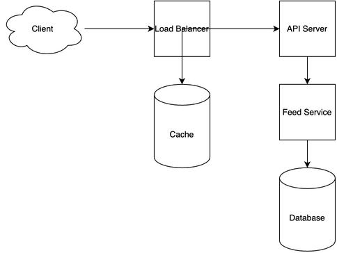

# News Feed System Design

[← Back to System Design](../system-design.md)

## Overview

A news feed system is a real-time content delivery platform that aggregates and displays personalized content to users. The system needs to handle high-volume content ingestion, real-time updates, personalized content ranking, and efficient content delivery. It requires sophisticated recommendation algorithms, efficient caching strategies, and a scalable infrastructure to support millions of users viewing and interacting with content in real-time.

## Functional Requirements

## Non-Functional Requirements

## Back of the Envelope Estimations

## API Endpoints

## Object Model

## System Design Diagram

[Download Draw.io File](news-feed.drawio)

## Additional Notes

