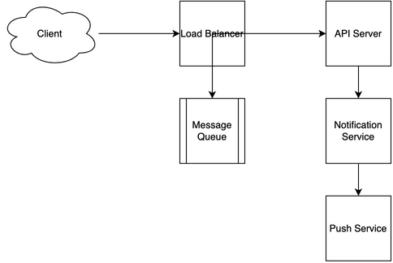

# Notification System Design

[← Back to System Design](../system-design.md)

## Overview

A notification system is designed to deliver real-time alerts and messages to users across multiple channels and devices. The system needs to handle high-volume message delivery, support multiple notification types, manage user preferences, and ensure reliable delivery across various platforms. It requires robust message queuing, efficient routing mechanisms, and a scalable infrastructure to support millions of notifications per second while maintaining low latency and high reliability.

## Functional Requirements

## Non-Functional Requirements

## Back of the Envelope Estimations

## API Endpoints

## Object Model

## System Design Diagram

[Download Draw.io File](notification-system.drawio)

## Additional Notes

