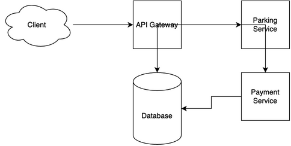

# Parking Garage System Design

[← Back to System Design](../system-design.md)

## Overview

A parking garage system manages vehicle entry, exit, and space allocation in parking facilities. The system needs to handle real-time space tracking, automated entry/exit processing, payment processing, and reservation management. It requires reliable sensors, efficient space allocation algorithms, and a robust infrastructure to support multiple entry/exit points, various payment methods, and real-time space availability updates.

## Functional Requirements

## Non-Functional Requirements

## Back of the Envelope Estimations

## API Endpoints

## Object Model

## System Design Diagram

[Download Draw.io File](parking-garage.drawio)

## Additional Notes
