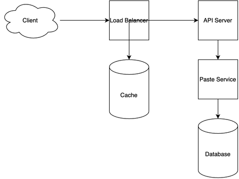

# PasteBin System Design

[← Back to System Design](../system-design.md)

## Overview

PasteBin is a text-sharing service that allows users to store and share code snippets, text, and other content through unique URLs. The system needs to handle high-volume text storage, quick content retrieval, syntax highlighting, and expiration management. It requires efficient storage mechanisms, fast content delivery, and a scalable infrastructure to support millions of paste operations while maintaining low latency and high availability.

## Functional Requirements

## Non-Functional Requirements

## Back of the Envelope Estimations

## API Endpoints

## Object Model

## System Design Diagram

[Download Draw.io File](pastebin.drawio)

## Additional Notes

