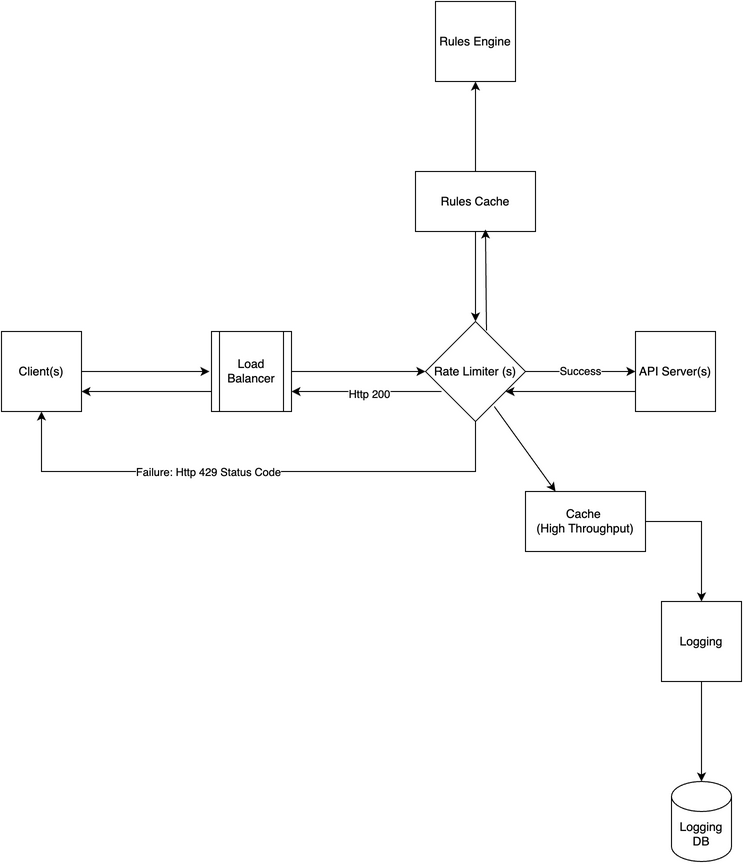

# Rate Limiter System Design

[← Back to System Design](../system-design.md)

## Overview

A rate limiter is a system component that controls the rate of requests a service can handle, preventing abuse and ensuring fair resource usage. The system needs to handle high-volume request tracking, implement various rate-limiting algorithms, and maintain consistent limits across distributed systems. It requires efficient request counting mechanisms, distributed coordination, and a scalable infrastructure to support millions of requests per second while maintaining accurate rate limiting.

## Functional Requirements

## Non-Functional Requirements

## Back of the Envelope Estimations

## API Endpoints

## Object Model

## System Design Diagram

[Download Draw.io File](rate-limiter.drawio)

## Additional Notes

Rate Limiter
Specified no of requests in specified period of time

Prevent DDos attacks

Reduce Cost as less servers are needed

Prevents load on the Server

Requirements
Server Side Rate Limiter since Client Side could be forged or bypassed

Throttle based on identifier such as UserId, IP Address

IP Address better since it helps narrow down user, however new userId can be created on the fly.

Inform the user when they are blocked

Http protocol with 429 status code to tell Too Many Requests

Instrumentation and Traffic Pattern analysis

Different algorithm Options,

- Token Bucket System
- Fixed Window System
- Sliding Window:

What to do when users get rate limited
Discuss traffic patterns when integrating

Consider moving to higher plan

Handle scenario gracefully. Eg, retry