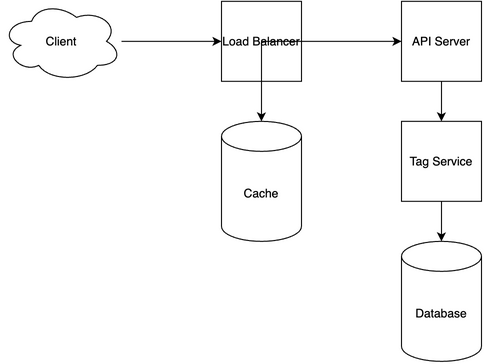

# Tag Service System Design

[← Back to System Design](../system-design.md)

## Overview

A tag service is a system that manages and organizes content through metadata tags, enabling efficient content categorization and retrieval. The system needs to handle tag creation, association, and querying across multiple content types, support tag hierarchies, and provide fast tag-based search capabilities. It requires efficient indexing mechanisms, flexible tag relationships, and a scalable infrastructure to support millions of tags and their associations while maintaining quick search performance.

## Functional Requirements

## Non-Functional Requirements

## Back of the Envelope Estimations

## API Endpoints

## Object Model

## System Design Diagram

[Download Draw.io File](tag-service.drawio)

## Additional Notes
