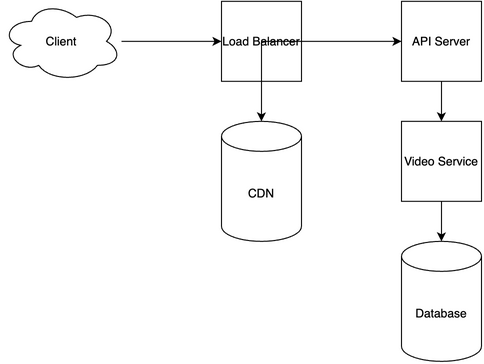

# TikTok System Design

[← Back to System Design](../system-design.md)

## Overview

TikTok is a short-form video sharing platform that enables users to create, share, and discover content through an AI-powered recommendation system. The system needs to handle massive video storage, real-time content delivery, personalized recommendations, and social interactions. It requires efficient video processing pipelines, sophisticated recommendation algorithms, and a scalable infrastructure to support billions of users and their daily video consumption while maintaining low latency and high availability.

## Functional Requirements

## Non-Functional Requirements

## Back of the Envelope Estimations

## API Endpoints

## Object Model

## System Design Diagram

[Download Draw.io File](tiktok.drawio)

## Additional Notes
