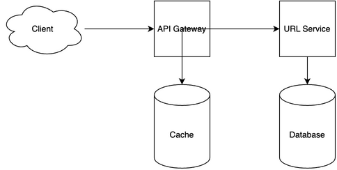

# URL Shortener System Design

[← Back to System Design](../system-design.md)

## Overview

A URL shortener is a service that converts long URLs into shorter, more manageable links while maintaining the ability to redirect to the original URLs. The system needs to handle high-volume URL shortening, fast redirection, and analytics tracking. It requires efficient URL generation algorithms, fast lookup mechanisms, and a scalable infrastructure to support millions of URL shortenings and redirects while maintaining low latency and high availability.

## Functional Requirements

## Non-Functional Requirements

## Back of the Envelope Estimations

## API Endpoints

## Object Model

## System Design Diagram

[Download Draw.io File](url-shortener.drawio)

## Additional Notes
