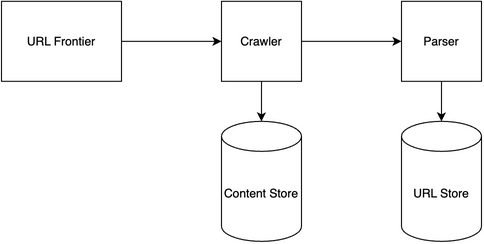

# Web Crawler System Design

[← Back to System Design](../system-design.md)

## Overview

A web crawler is a system that systematically browses and indexes web pages across the internet. The system needs to handle distributed crawling, content parsing, URL management, and efficient storage of crawled data. It requires robust URL frontier management, polite crawling policies, and a scalable infrastructure to support billions of web pages while maintaining efficient resource usage and respecting website crawling rules.

## Functional Requirements

## Non-Functional Requirements

## Back of the Envelope Estimations

## API Endpoints

## Object Model

## System Design Diagram

[Download Draw.io File](webcrawler.drawio)

## Additional Notes
